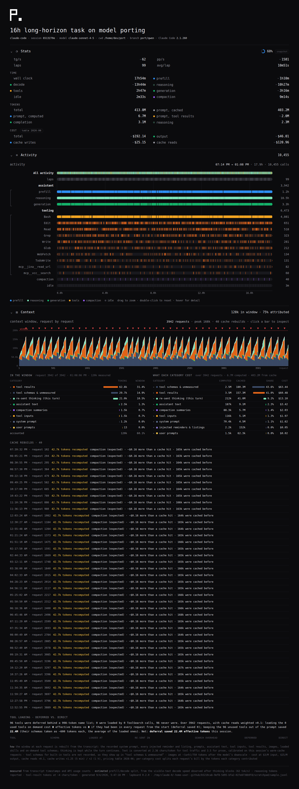

# tokenograph

Tokenometrics for coding-agent sessions. Point it at a Claude Code transcript or a pi
session and it renders one page: throughput, an additive wall-clock split, token and cost
accounting, a per-row timeline of every call, and a ledger of what is in the context
window, what each part has cost, and why the cache was rebuilt. It also exports the
session as a property graph and watches a whole fleet of sessions with herdr's states.



It started as a clean-room equivalent of the run-stats panel Han Xiao posted for a
16-hour autonomous coding run ([the post](https://x.com/hxiao/status/2095609195030864347)).
Python standard library only, no build step.

```
python3 -m tokenograph list                          # Claude Code and pi sessions, newest first
python3 -m tokenograph build latest -o panel.html    # self-contained HTML, open it anywhere
python3 -m tokenograph serve latest --open           # live panel that follows a running session
python3 -m tokenograph fleet --serve --open          # every session, herdr-style states, live
python3 -m tokenograph graph latest -o s.graphml     # the session as a property graph
python3 -m tokenograph json  <session-id-or-path>    # the computed numbers, for other frontends
```

`latest`, a session id prefix, a directory, or a path to a `.jsonl` all work. The format
is detected from the file (`--format claude|pi` to force it). Subagent transcripts stored
next to a Claude Code session are merged in (`--no-subagents` to skip).

## Sources

| agent | where tokenograph looks | what the file records |
|---|---|---|
| Claude Code | `~/.claude/projects/<project>/<session>.jsonl` (`CLAUDE_CONFIG_DIR` respected) | one entry per streamed content block with a timestamp, exact usage per request, tool results, injected reminders, the system prompt (`prompt_snapshot`), compaction markers |
| pi ([pi-mono](https://github.com/badlogic/pi-mono)) | `~/.pi/agent/sessions/<cwd>/<stamp>_<id>.jsonl` (`PI_CODING_AGENT_DIR` respected) | one entry per message with start and end timestamps, usage including pi's own cost figure, tool results, compactions, model changes |

pi records no per-block timing and no system prompt, so for pi sessions the prefill/decode
split comes from a latency fit and the system prompt shows up under "tool schemas &
unmeasured". pi's recorded cost is shown next to tokenograph's estimate; on pi's own test
fixtures the two agree to the cent.

## The panel

**Stats.** tg/s (completion tokens per second of decode time), pp/s (computed prompt
tokens per second of prefill time), laps (one per user prompt; an autonomous loop that
re-prompts makes one lap per iteration) and the mean lap. The ring is the context-window
fill of the latest request. TIME is additive: wall clock = prefill + reasoning +
generation + tools + compaction + idle, every instant attributed to exactly one phase.
TOKENS: total = prompt computed + prompt cached + completion; reasoning is a subset of
completion. COST, when the model's pricing is known: output, cache writes (at the 5-minute
or 1-hour write premium the API reported), cache reads (at the read discount), uncached
input. `--price IN,OUT[,READ_MULT,WRITE5M_MULT,WRITE1H_MULT]` overrides the built-in table,
which is a dated snapshot.

**Activity.** One row per category over wall-clock time: an "All activity" strip, laps
numbered in order, the three assistant phases, one row per tool name, compactions,
interrupts and errors, idle stretches. Hover any bar for the call behind it; drag to zoom,
double-click to reset. In `serve` mode the page follows the transcript and the spinner
next to the ring shows it is live.

**Context.** The window reconstructed at every request, as a stacked chart with the
API's measured input total drawn over it, and three tables:

- *in the window*: what the latest request carried, by category and by item: system prompt
  sections, the built-in tool block, tool schemas loaded on demand, injected reminders and
  listings (skills listing, MCP instructions, deferred tool names, agent listing, task and
  budget reminders), loaded skills by name, prompts, images, assistant text, tool inputs
  and tool results by tool, re-sent thinking, compaction summaries. Click a bar in the
  chart to see the same breakdown for an earlier request.
- *what each category cost*: over the whole session, the tokens each category had computed
  (uncached input plus cache writes) and served from cache, its share weighted by the cache
  read discount, and its dollar share of the input bill. This is the "what is costing me
  what" table: a 20k-token skill loaded once and re-sent for 40 requests, a 150k-token tool
  result, the listings that ride along on every request.
- *cache rebuilds*: requests where the cached prefix was lost and most of the window was
  recomputed, with the likely cause: a system-prompt section that changed (named, with its
  size delta), a compaction, a cache TTL that expired during an idle gap, a model switch.
  On Claude Fable 5.1 a single rebuild of a 350k-token window is a five-dollar event.
- *tool loading*: deferred vs. direct, see below.

## How it works

- **Model calls.** Claude Code writes each streamed content block as its own entry with a
  timestamp and the request's usage; blocks are grouped by `requestId`. A request starts at
  the last non-assistant entry before its first block and ends at its last block. pi
  writes one entry per message; the message carries the request's start time and the entry
  its end.
- **Tool calls.** A `tool_use` block is paired with the `tool_result` carrying its id.
  Claude Code starts a tool as soon as its block has streamed, so calls in one message
  overlap; pi runs them after the message, one after another. The wall-clock split gives
  model phases priority over tools where they overlap.
- **Laps, compactions, idle.** Every user prompt that is not a tool result, a compaction
  summary or an interrupt marker opens a lap. Compactions are `compact_boundary` markers
  and `isCompactSummary` messages (Claude Code) or `compaction` entries (pi). Idle is time
  with nothing running, split into waiting for the user and overhead.
- **Context ledger.** Every entry that ends up in the prompt becomes an item with a
  category and a size. At each request the window is the latest system prompt snapshot
  plus every item since the last compaction (thinking blocks only while the turn
  continues). Text is converted to tokens at two rates, one for tool traffic (shell output,
  JSON, code) and one for prose, both calibrated on this session: on requests served from
  a warm cache, the API's computed tokens are exactly the new content since the previous
  request. When a system-prompt change rebuilds the cache, what stays cached is the prefix
  before the system prompt, i.e. the built-in tool block; tokenograph uses that as the floor
  of "tool schemas & unmeasured" and scales estimates that exceed the measured window.
  Each request's input bill is then split across the categories by the tokens they
  contributed, new content first.

### Measured vs. estimated

Timestamps, per-request usage, cache reads and writes, thinking tokens (when reported),
and pi's cost are measured. Estimated, and marked `~` in the panel: the prefill/decode
split (from the decode speed observed on visible text after thinking blocks; a latency fit
when there is no per-block timing), token counts derived from characters, image tokens
(about width × height / 750 after the model's downscale), and dollar cost from the pricing
table. On a synthetic run with known timings the prefill estimate lands within a few
percent and decode and tool times are exact (`tests/`).

### Deferred vs. direct tool loading

Claude Code can keep a tool's schema out of the prompt and list only its name; the model
fetches the schema with `ToolSearch` when it wants the tool. Whether that is cheaper than
loading the schema directly depends on three measurable quantities, and the panel computes
all three from the transcript:

1. **The listing.** The deferred names ride along on every request. Cost = listing tokens
   × requests, almost all of it served from cache.
2. **The search round trip.** If a `ToolSearch` call had a request to itself, the extra
   round trip cost that request's output plus the newly computed input of the next request,
   and its latency. If the model batched the search with other tool calls, the overhead is
   only the search block and its result.
3. **The schema, once loaded,** is re-sent on every later request, exactly as a directly
   loaded schema would have been from request one. Unused deferred tools cost nothing but
   their listing line; their schemas are taken as the average size of the ones that were
   loaded, since the transcript never sees them.

Effective tokens weight cached tokens by the model's cache-read multiplier, so the
comparison reflects what you pay rather than raw token counts. The verdict line states the
net for the session. In practice the round trips make deferral slightly more expensive for
the handful of tools you do use and enormously cheaper for the dozens you do not; the table
shows which tools were loaded solo, at which request, and how many requests re-sent them.

## Fleet and herdr

`tokenograph fleet` lists every Claude Code and pi session on the machine with a state in
[herdr](https://github.com/ogulcancelik/herdr)'s vocabulary, derived from the transcript
tail: **working** (producing or running a tool), **blocked** (a tool call has waited more
than 20 s for its result, usually a permission prompt or a question), **done** (the turn
ended and nobody has prompted since), **idle**. Each row shows laps, wall clock, context
fill, computed and cached tokens, output, estimated cost and last activity; in `--serve`
mode the rows link to live per-session panels.

When herdr is running, tokenograph also asks it. herdr exposes a newline-delimited JSON
socket at `$XDG_CONFIG_HOME/herdr/herdr.sock` (or `~/.config/herdr/herdr.sock`, or the
`HERDR_SOCKET_PATH` a pane inherits); `agent.list` returns every pane's agent, its
detected status and the agent's own session id, which herdr's Claude Code and pi
integrations report to it at session start. tokenograph joins on that id (falling back to a
unique working directory) and shows herdr's status next to its own, with herdr's driving
the ordering. Nothing is written to herdr.

## Graph export

A session is already a graph: prompts open laps, laps contain requests, each request
reuses the previous one's cached prefix, tool calls are invoked by one request and feed
the next, compactions fold a run of requests into a summary, and every context category
is present in every request with a token weight. `tokenograph graph` writes that graph
as node-link JSON (`networkx.node_link_graph(data, edges="links")`), GraphML (Gephi,
yEd, igraph) or a CSV pair for Neo4j's importer.

```
session -has_lap-> lap -next-> lap
lap -contains-> request -follows-> request        weight: tokens served from cache
request -invokes-> tool -feeds-> request          weight: result tokens entering the next request
request -compacted_into-> compaction -resumes-> request
category -present_in-> request                    weight: tokens of that category in the window
rebuild -hits-> request                           weight: tokens recomputed, with the cause
```

Questions that are one query away once it is a graph: which tool results are still being
paid for twenty requests later (follow `feeds` then `follows`); which lap's prompt led to
the most expensive subgraph; what the shortest path from a system-prompt change to a
rebuild looks like; which categories dominate the window after each compaction.

## Data model

`tokenograph json` emits what the page renders:

```
meta    title, agent (claude-code | pi), session id, models, cwd, branch, estimates used
base    session start (epoch seconds); all times below are relative to it
stats   tg_s, pp_s, laps, avg_lap_s, time{...}, tokens{...}, context{...}, counts{...},
        cost{total,input,output,cache_read,cache_write,pricing} or null, cost_reported (pi)
calls   k=m model call {t0,t1,p:[prefill_end,reasoning_end],tok:[computed,cached,out,thinking],lap,stop,tools}
        k=t tool call  {t0,t1,n:name,l:label,ch:result chars,err,open}
        k=c compaction, k=x interrupt, k=b user shell command (pi), k=e API error
laps    {n,t0,t1,calls,tools,l:prompt}
tools   per-name count, total seconds, errors
idle    [t0,t1,'w'|'o'] waiting-for-user or overhead
ledger  cpt, cpt_prose, tool_block_hint, series[{t,m,in,cc,cr,g{category:tokens}}],
        now{rows[...]}, cum{rows[...],computed,cached,requests}, events[...], tools{...}
```

`tokenograph fleet` (static) or `/fleet.json` (served) emits one row per session with the
same stats plus `state`, `herdr` (status, pane, workspace, name) and `age_s`.
`tokenograph graph` emits `{directed, nodes:[{id, kind, ...}], links:[{source, target, kind, weight}]}`.

## Files

```
tokenograph.py              adapters (Claude Code, pi), metrics, ledger, fleet, CLI
panel.html               the session page; build inlines the data into it
fleet.html               the fleet page
examples/make_sample.py  synthetic 16h transcript generator with ground-truth timings
examples/sample-panel.png    the panel built from that synthetic run (screenshot above)
tests/                   python3 -m unittest discover -s tests
```

To reproduce the screenshot without a real session:

```
python3 examples/make_sample.py --hours 16 --laps 99 --out /tmp/sample.jsonl
python3 -m tokenograph build /tmp/sample.jsonl --title "16h long-horizon task on model porting" -o sample.html
```

## Limitations

- Timing resolution is the transcript's: whole requests and tool calls, not token streams.
  Permission prompts and hook execution inside a tool call count as tool time.
- The built-in tool block is never written to a Claude Code transcript; it is inferred from
  cache retention when a system-prompt change happens, otherwise it is the residual.
- Image tokens follow the documented downscale rule; the API does not report them
  separately, so they cannot be calibrated.
- The pricing table is a snapshot and does not cover partner platforms; pass `--price`.
- Cost is attributed to categories by token share, which is the only split the usage
  counters support.
